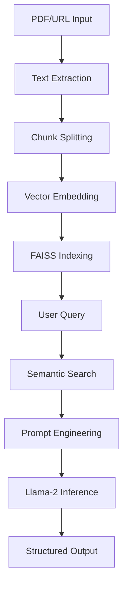

# Research Paper Q&A Assistant 
*Advanced NLP Document Analysis System*

[](https://streamlit.io)
[](https://huggingface.co)
[](https://pytorch.org)

## Overview 💡
A production-ready AI application that analyzes research papers using Retrieval-Augmented Generation (RAG). Processes academic PDFs to provide:
- Structured Q&A responses
- Concise summaries
- Auto-generated quizzes
- Mathematical concept explanation

**Technical Highlight**: Implements 4-bit quantized Llama-2-7B on consumer hardware using advanced optimization techniques.

## Key Features 🚀
| Feature | Description | Tech Used |
|---------|-------------|-----------|
| **Document Ingestion** | PDF/URL processing with text extraction | PyPDF2, WebBaseLoader |
| **Semantic Search** | Context retrieval using similarity search | FAISS, MiniLM embeddings |
| **Structured Q&A** | Academic-style responses with section headers | Custom prompt engineering |
| **AI Processing** | Memory-efficient LLM inference | BitsAndBytes, 4-bit quantization |
| **Deployment** | Cloud-ready with tunneled access | Streamlit, ngrok |

## Technical Architecture 🧠


## Setup & Installation ⚙️

### Prerequisites
- Python 3.10+
- Hugging Face API token (free account)
- ngrok account (free tier)

```

### Running Locally
```bash
streamlit run app.py
```

### Cloud Deployment
```bash
python ngrok_deploy.py  # Automatic tunnel setup
```

## Usage Guide 📖
1. **Upload PDFs** or **enter paper URL**
2. Process documents
3. Ask questions like:
   - "Explain the core mathematical framework"
   - "What are the practical applications?"
   - "Describe the attention mechanism"
4. Use analysis tools:
   - Generate 100-word summaries
   - Create self-assessment quizzes

## Technical Highlights 💻
- **Quantization**: 4-bit model loading (~40% memory reduction)
- **Prompt Engineering**: Structured academic output templates
- **Vector Search**: MMR (Maximal Marginal Relevance) retrieval
- **Efficient Text Processing**: Recursive chunking with overlap
- **Production-Ready**: Clipboard integration, error handling, UI feedback

## Project Structure 🗂️
```
research-paper-qa/
├── app.py                # Main application logic
├── ngrok_deploy.py       # Cloud deployment script
├── requirements.txt      # Dependencies
├── .env.example          # Environment template
├── notebooks/            # Development notebooks
└── assets/               # Sample outputs
```

## Sample Output 🖥️
### Structured Q&A Response:
```markdown
## Research Paper Analysis

### 🔑 Key Concept 
Transformers replace RNNs with self-attention mechanisms...

### 📐 Mathematical Formulation
Attention(Q,K,V) = softmax(QKᵀ/√dₖ)V  
Where Q=queries, K=keys, V=values...

### 💡 Mathematical Intuition
Allows modeling dependencies without regard to distance...

### 🚀 Practical Implications
1. Machine translation improvement
2. Parallel computation efficiency
3. Long-range dependency handling...
```

## Future Enhancements 🔮
- [ ] Support LaTeX equation rendering
- [ ] Paper metadata extraction
- [ ] Multi-document comparison
- [ ] Citation graph visualization

---

**Note for Resume**: This project demonstrates expertise in NLP, model optimization, and full-stack ML development. Highlight these key skills:
- Implemented RAG architecture for document analysis
- Optimized LLMs for resource-constrained environments
- Designed academic-focused output schemas
- Built production-ready interface with error handling
- Integrated multiple NLP components into cohesive system
