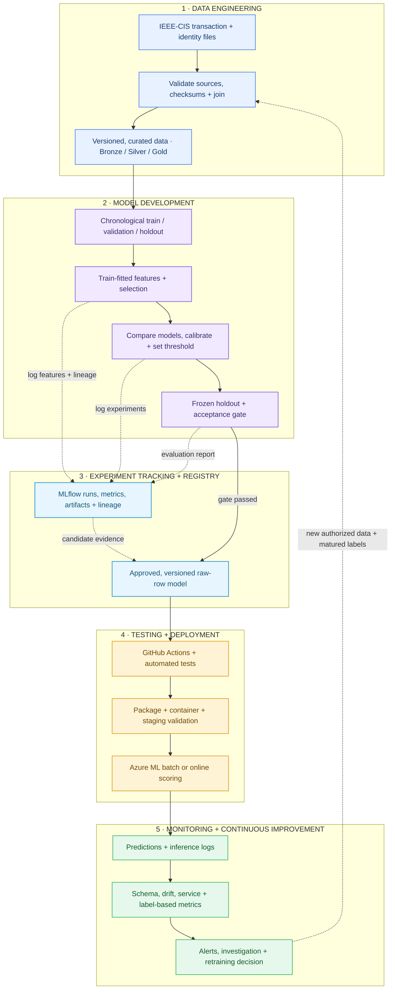

# Credit Card Fraud Detection System

**IEEE-CIS Fraud Detection | Reproducible Machine Learning + End-to-End MLOps Roadmap**

This project develops a fraud-detection workflow using the IEEE-CIS Fraud Detection dataset. It combines leakage-aware data preparation, chronological evaluation, fitted feature engineering, feature selection, model comparison, probability calibration, MLflow experiment tracking, model registration, and batch prediction.


## 1. Project objectives

- Build a reliable fraud classifier for highly imbalanced transaction data.
- Preserve chronological boundaries to reduce temporal leakage.
- Fit transformations and feature selection only on eligible training partitions.
- Compare models using fraud-appropriate metrics rather than accuracy alone.
- Keep the selected preprocessing, model, calibration, and threshold together as a **single raw-row inference artifact**.
- Track experiments, dataset fingerprints, metrics, and model versions using MLflow.
- Extend the existing implementation with automated validation, deployment, monitoring, and a retraining feedback loop.

## 2. Dataset

**Source:** [IEEE-CIS Fraud Detection (Kaggle competition)](https://www.kaggle.com/competitions/ieee-fraud-detection)

The dataset consists of transaction tables and separate identity tables, joined using `TransactionID`.

| Dataset component | Rows | Notes |
|---|---:|---|
| `train_transaction.csv` | 590,540 | Labeled transactions and `isFraud` target |
| `train_identity.csv` | 144,233 | Identity and device attributes for a subset of transactions |
| `test_transaction.csv` | 506,691 | Later, unlabeled transactions for inference |
| `test_identity.csv` | 141,907 | Identity and device attributes for a subset of test transactions |
| Fraud cases in labeled transactions | 20,663 | Approximately 3.50% of labeled transactions |

The labeled transaction table has 394 columns (including `isFraud`) and the identity table has 41. A left join on `TransactionID` yields 434 distinct raw columns before feature processing. Missing identity records are expected and must be handled explicitly.

The dataset is challenging because fraud is rare, some identity/device columns are sparse or high-cardinality, and transaction time matters. The later Kaggle test set has **no accessible ground-truth labels** in these files. Its predictions are useful for testing inference coverage and alert generation, **not** for claiming precision, recall, or model accuracy.

**Data handling:** Genuine raw data is not committed to Git. Download the four competition CSV files yourself and place them under `data/raw/`. Do not replace missing real data with fabricated records for performance reporting.

## 3. System architecture (target: practical end-to-end MLOps, Version 1)

The architecture intentionally keeps the operational design understandable while retaining all essential lifecycle stages. The five stages are connected; MLflow tracking happens **during** experiments, not only after training, and retraining starts with **validated new data**, not directly at feature selection.



**How to read the diagram:** Solid arrows show the main processing/release flow; dashed arrows show experiment logging and the data-driven feedback loop. CI/CD should also test changes to training code; the deployment block highlights the release gate, not the only place testing occurs.

### Architecture stage responsibilities

| Stage | Purpose | Main technologies | Version 1 output |
|---|---|---|---|
| 1. Data engineering | Validate, join, curate, fingerprint and partition data | Python, pandas, manifests/checksums | Reproducible datasets and schema records |
| 2. Model development | Fit features, select, train, calibrate, evaluate | scikit-learn, LightGBM, XGBoost; optional GPU | Frozen evaluated candidate and full inference pipeline |
| 3. Tracking and registry | Record runs and lineage; version approved artifacts | MLflow | Registered model with preprocessing + threshold |
| 4. Testing and deployment | Test, package, stage, deploy and smoke-test | pytest, GitHub Actions, Docker, Azure ML | Working batch job or managed endpoint |
| 5. Monitoring and retraining | Record health, drift, outcomes and controlled upgrades | Azure Monitor / Application Insights; monitoring jobs | Alerts, reviewable reports and a new candidate cycle |

### Training path versus inference path

These are distinct runtime paths and must use the **same saved feature definitions**:

```text
TRAINING
Historical labeled rows
  -> validated temporal partitions
  -> fit feature engineering / encoders / selectors on training data
  -> candidate models + calibration + threshold selection
  -> frozen evaluation -> MLflow run -> approved registered artifact

INFERENCE
New raw transaction (+ available identity fields)
  -> validate raw schema
  -> apply saved transformations and selected features (NO refitting)
  -> registered model probability
  -> stored alert threshold
  -> fraud score / alert / model version / prediction log
```

The deployable artifact is the complete pipeline, not just a bare LightGBM/XGBoost model. Inference must not refit encoders, alter feature order, derive information from future transactions, or recompute the alert threshold.

## 4. Machine-learning workflow already documented

### 4.1 Source validation and chronological partitions

The preparation stage rejects missing, invalid, or Git LFS pointer files, checks key identifiers and source fingerprints, joins transaction and identity tables, and creates chronological train, validation, and holdout partitions. Subsequent notebook stages reuse the established boundaries.

For the MLOps upgrade, the **Bronze / Silver / Gold** terminology represents progressively prepared data:

- **Bronze (raw):** Immutable source CSV files and their checksum manifest.
- **Silver (validated):** Schema-checked, joined data with recorded missingness, duplicates and timestamp integrity.
- **Gold (model-ready):** Versioned curated inputs and temporal split metadata ready for fitted model transformations.

These are **logical target layers**. Do not describe them as existing cloud data-lake infrastructure unless the corresponding pipeline and storage have actually been implemented. Dataset versioning can start with cryptographic hashes and manifest files; a separate DVC service or lakehouse is not mandatory in Version 1.

### 4.2 Feature engineering

Features cover transaction, card, address, email, device, identity, time, missingness, and `V`-family patterns. Numerical imputation, categorical mappings and optional learned features are fitted on permitted training data only. The exact fitted transformations are reused for validation, holdout, and subsequent inference.

### 4.3 Feature selection

The project compares techniques including correlation, random-forest importance, L1 regularization, permutation/boosting rankings, and a consensus approach. Optional GPU acceleration supports expensive screening. Selection stability and the final feature list are retained with the model recipe so later scoring cannot silently change feature order.

### 4.4 Model comparison and calibration

Candidate models include logistic regression, random forest, XGBoost and LightGBM. **Average precision (PR-AUC summary)** is a primary selection measure for the rare positive class. Also review ROC-AUC, precision, recall, F1, Brier score, calibration plots and the operational number of alerts.

The documented workflow preserves the observed class distribution rather than relying on SMOTE. A calibrated development candidate is evaluated with a separate validation block, and its chosen alert threshold is saved inside the complete `FraudPipeline`.

### 4.5 Frozen holdout gate

After feature choices, hyperparameters, calibration and threshold are fixed, the selected pipeline receives its final holdout evaluation. The holdout must not be reused for selecting a better model or tuning a threshold. If the system undergoes repeated retraining rounds, use appropriately **new time-forward evaluation windows** rather than repeatedly optimizing on an old holdout.

**Production-candidate approval is a separate decision:** evaluate the exact final packaged candidate against pre-agreed gates before deployment. A strong validation result for one model does not automatically establish the holdout result of another.

## 5. Documented experimental results

The following values are retained from the existing project README. They describe **different model/split assessments**, not a single model improving across all rows.

| Model / assessment | Split | ROC-AUC | Average precision | Precision | Recall | F1 | Brier score |
|---|---|---:|---:|---:|---:|---:|---:|
| Baseline pipeline | Validation | 0.9042 | 0.4688 | 0.5897 | 0.3602 | 0.4473 | 0.0939 |
| Calibrated GPU LightGBM | Validation | **0.9071** | **0.5192** | **0.6456** | **0.4301** | **0.5163** | **0.0232** |
| Frozen selected pipeline | Holdout | 0.8815 | 0.4524 | 0.5042 | 0.4122 | 0.4536 | 0.1021 |

The calibrated LightGBM experiment improved the *reported validation* metrics. The separate frozen holdout row measures the selected pipeline on unseen data. Before any deployment claim, reproduce the same exact registered artifact, data scope, and evaluation report.

### Unlabeled test scoring

The existing README reports successful raw-row scoring for **506,691** unlabeled transactions:

| Output | Reported value |
|---|---:|
| Rows scored | 506,691 |
| Stored alert threshold | 0.2019 |
| Fraud alerts | 15,848 |
| Alert rate | 3.13% |

This supports coverage and consistency checks (e.g. `TransactionID` order, non-null probabilities, probability bounds and alert counts). It **does not** prove live fraud detection quality because these transactions lack accessible ground-truth outcomes.

## 6. Experiment tracking, model registry and lineage

The documented local workflow uses the MLflow experiment `ieee_cis_fraud_detection` and the registered model name `ieee_cis_fraud_detector`.

MLflow tracking should begin **while models are trained and compared**, recording:

- Source manifest and hashes, data scope and chronological partition fingerprints.
- Code/configuration version, random seed, model/feature recipe and dependencies.
- Candidate hyperparameters, scores, calibration/threshold choices and reports.
- Saved fitted raw-row pipeline, signature/input contract and artifact references.

After the final candidate passes its quality gate, register **that precise artifact** in the model registry. A version can be referenced as:

```text
models:/ieee_cis_fraud_detector/<version>
```

Registry verification should reload the registered version and compare its probabilities and alert labels with the original approved pipeline on identical input rows. This prevents the deployable artifact from diverging from the artifact that was evaluated. Registration is **not** the same as automatic approval for production.

## 7. Testing, CI/CD and deployment plan

These are Version 1 **implementation requirements**, not completed-cloud-service claims.

### Automated quality checks

1. **Data tests:** expected files, checksums, schema, unique transaction identifiers, missingness policy, valid partition order.
2. **Leakage tests:** encoders/selectors fit on allowed rows only; no holdout labels used during training or threshold selection.
3. **Pipeline tests:** load/reload consistency, feature order, output shape, probabilities between 0 and 1, deterministic behavior where applicable.
4. **Inference contract tests:** accept valid raw joined transaction rows, reject malformed payloads and unknown required fields with clear errors.
5. **Deployment smoke tests:** pinned registered-model version, successful sample prediction, basic health and operational logging.

GitHub Actions will eventually run fast unit/static tests on pull requests and gated integration tests on suitable runners. Do **not** put restricted competition data or cloud credentials into public CI artifacts. Long GPU training jobs can run on an authorized local/Azure runner rather than every pull request.

### Deployment choice: start with batch, then online

**First end-to-end release:** Use the already documented batch-prediction path, wrap it in a repeatable job, and demonstrate registered-model loading plus a prediction export. The next release can expose the same pipeline via an Azure ML managed online endpoint.

Recommended controlled release flow:

```text
Git commit / pull request
  -> CI tests
  -> approved MLflow model version
  -> inference package + pinned environment
  -> staging deployment + smoke tests
  -> production batch job or managed online endpoint
  -> logs and monitoring
```

Docker is useful for consistent serving. Azure ML managed environments may create the container image for a deployment; manually building and pushing to Azure Container Registry (ACR) is **not required in every Azure ML deployment scenario**. If you use a custom container, then explicitly manage its build, ACR storage, tag/digest and rollout.

Retain the previous known-good model/deployment version for rollback. Promotion requires test evidence and explicit approval criteria, not simply a newer registration timestamp.

## 8. Monitoring and controlled retraining plan

A deployed model needs **two different kinds of monitoring**:

| Signal type | What to check | When it becomes meaningful |
|---|---|---|
| Service/operational | Request failures, p95 latency, throughput, model version, job errors | Immediately after deployment |
| Data quality | Schema violations, null rates, unseen categories, numeric-range changes | As new inputs arrive |
| Prediction behavior | Score distribution, alert rate, prediction drift | As predictions accumulate |
| Model performance | Precision, recall, average precision, calibration | Only after matched confirmed fraud labels arrive |
| Business impact | Review volume, false-positive cost, missed-fraud cost | When credible cost/outcome information is available |

Azure Monitor/Application Insights can collect supported service telemetry. Model-quality and data-drift reports require explicitly defined input/output collection, reference windows, scheduled checks and, for label-based metrics, a dependable label join. An alert starts **investigation**, not automatic unreviewed model replacement.

### Retraining feedback loop

```text
New authorized transactions + matured fraud labels
  -> ingestion and validation
  -> new versioned temporal datasets
  -> retrain fitted transformations, selectors and candidate model
  -> MLflow metrics and lineage
  -> new forward-looking evaluation + promotion gate
  -> approved registered model
  -> CI/staging/deploy/monitor
```

The provided Kaggle `test_*.csv` tables cannot supply true delayed fraud labels on their own. For an educational MLOps demonstration, use **clearly labeled historical replay/simulation** to exercise scheduling, monitoring and retraining logic; distinguish these tests from real banking operations.

## 9. Repository structure

The existing structure below reflects the project layout documented in the original README. Files marked in the roadmap later in this section are **proposed additions**, not claimed to be present today.

```text
credit-card-fraud-detection-system/
├── eda/
│   └── 01_explore_transactions.ipynb
├── notebook/
│   ├── 00_data_preparation.ipynb
│   ├── 01_feature_engineering.ipynb
│   ├── 02_feature_selection.ipynb
│   ├── 03_modeling_baselines.ipynb
│   └── 04_model_selection.ipynb
├── src/
│   └── fraud_detection/
│       ├── data.py
│       ├── data_preparation.py
│       ├── features.py
│       ├── feature_selection.py
│       ├── models.py
│       ├── experiments.py
│       ├── evaluation.py
│       ├── predict.py
│       └── tracking.py
├── requirements.txt
├── requirements-local.txt
├── requirements-gpu.txt
└── pyproject.toml
```

**Potential next additions (create them only as work is implemented):**

```text
tests/                         # data, leakage, pipeline and inference tests
.github/workflows/            # test and release automation
configs/                      # environment and reproducible job configuration
pipelines/                    # executable training / batch-scoring entry points
deployment/                   # Docker / Azure ML deployment definitions
monitoring/                   # logging schema, drift checks and alert policies
```

Never commit genuine raw competition files, large generated datasets, credentials, local MLflow databases or model binaries unless the repository's data/license and artifact policies explicitly allow it. Keep sample fixtures clearly separate from true evaluation data.

## 10. Run the existing workflow locally

### Prerequisites

- Git and Python 3.11.
- The four genuine IEEE-CIS CSV files from Kaggle.
- A notebook-capable local environment (for example, Jupyter in VS Code).
- Optional compatible GPU dependencies only if GPU features are needed.

### Clone and install (Windows PowerShell)

```powershell
git clone https://github.com/BantPawan/Pawan-Project.git
cd Pawan-Project/credit-card-fraud-detection-system

py -3.11 -m venv .venv
.\.venv\Scripts\python.exe -m pip install -r requirements-local.txt
.\.venv\Scripts\python.exe -m pip install -e . --no-deps
```

Place these files in `data/raw/`:

```text
data/raw/
├── train_transaction.csv
├── train_identity.csv
├── test_transaction.csv
└── test_identity.csv
```

Open and execute the notebooks **in order**, using the created virtual environment as the kernel:

1. `notebook/00_data_preparation.ipynb` — genuine-data checks, fingerprinting and chronological partitions.
2. `notebook/01_feature_engineering.ipynb` — fitted feature transformations.
3. `notebook/02_feature_selection.ipynb` — selection methods, consensus and stability.
4. `notebook/03_modeling_baselines.ipynb` — candidate model training and comparison.
5. `notebook/04_model_selection.ipynb` — final model selection, calibration, holdout evidence, tracking and registration.

To enable the documented MLflow tracking/registration options in notebook `04`, set these **before running the relevant notebook cells**:

```python
import os

os.environ["FRAUD_NOTEBOOK_TRACK"] = "1"
os.environ["FRAUD_NOTEBOOK_REGISTER"] = "1"
```

The tracking backend/database must be configured and available for registration to succeed. Use the tracking URI printed or configured by the notebook for the corresponding MLflow UI. GPU execution is optional; install `requirements-gpu.txt` only in a compatible environment.

**Verification checkpoint:** Record source checksums, partition fingerprint, MLflow run ID, registered model version (if enabled), evaluation report and one successful same-input reload/scoring comparison. A README command alone does not prove a step was executed.

## 11. End-to-end MLOps implementation roadmap

| Milestone | Existing foundation | What must be added / demonstrated | Completion proof |
|---|---|---|---|
| **M1 — Reproducible data** | Raw-data validation, manifests, chronological partitions | Formalize Bronze/Silver/Gold outputs and repeatable dataset version metadata | Fresh run recreates validated partitions from the same inputs |
| **M2 — Reproducible ML** | Features, selection, baselines, holdout, batch scoring | Add repeatable pipeline entry point and automated leakage/inference tests | Tests pass; saved pipeline reproduces output |
| **M3 — Tracked & registered candidate** | MLflow integration and full pipeline artifact | Verify tracked runs, acceptance policy and model-version resolution | Model URI reload matches approved local artifact |
| **M4 — CI/CD + deployment** | Local batch predictor | GitHub Actions, packaging, staging, Azure ML batch or online job | Successful repeatable scoring job/endpoint and smoke test |
| **M5 — Observability** | Planned monitoring signals | Logs, dashboard/reports, drift thresholds and alerts | Traceable prediction + actionable monitor report |
| **M6 — Retraining demonstration** | Training and evaluation components | Historical replay / authorized new labels, candidate comparison and promotion gate | Complete new-data -> new-candidate -> controlled-release evidence |

Mark a milestone **complete only after execution evidence exists**. The roadmap is the plan to achieve the five-stage target architecture; it is not a claim that all stages are operational today.

## 12. Acceptance criteria for a genuine Version 1 MLOps demonstration

Before describing the system as an **implemented end-to-end MLOps workflow**, verify all of the following:

- [ ] A fresh environment can load and validate the permitted data with the same fingerprints.
- [ ] The chronological split and training-only fitting checks pass.
- [ ] At least one complete pipeline run produces the expected metrics and artifacts.
- [ ] MLflow records training evidence and the registry reload produces matching predictions.
- [ ] Automated tests pass in CI; secrets and real raw data are not exposed.
- [ ] The pinned model executes successfully through a deployed batch job or endpoint.
- [ ] Inference schema, output probabilities, alert threshold and model version are logged.
- [ ] Monitoring produces useful operational/data-quality signals and alerts.
- [ ] A controlled historical-replay retraining cycle evaluates a new candidate without bypassing approval.

## 13. Known limitations and responsible use

- **Offline research data:** IEEE-CIS is a competition dataset, not a live production banking feed. Production behavior and data drift can only be demonstrated using an explicitly identified simulation until authorized live inputs are available.
- **No fraud labels on the Kaggle test files:** Do not report test precision, recall, fraud losses, or calibration on unlabeled rows.
- **Temporal and entity leakage remain important risks:** Time-order splits help, but entity aggregation, historical statistics and delayed labels must still obey point-in-time availability.
- **Different evaluation rows are not directly interchangeable:** The reported validation LightGBM experiment and frozen holdout selected pipeline must not be presented as one identical final artifact without verification.
- **Decision costs are context-dependent:** F1-optimal thresholds are not necessarily cost-optimal; real false-positive budgets and loss assumptions need business validation.
- **Deployment status must be evidence-based:** Docker, Azure ML, Azure Monitor and CI/CD in the architecture are planned components until implemented and verified.
- **Privacy, security and compliance:** Never commit credentials or personal financial data; a real deployment requires authorization, role-based access, safe logging and appropriate retention rules.

## 14. Technologies

| Category | Current/project technology | Planned MLOps extension |
|---|---|---|
| Data | Python, pandas, manifests/checksums | Formalized data layers and repeatable data pipeline |
| Modeling | scikit-learn, XGBoost, LightGBM | Automated model training and acceptance checks |
| Experiment lifecycle | MLflow tracking and registry | Controlled promotion and reproducible releases |
| Engineering | Git, notebooks, Python package | pytest, GitHub Actions, configuration management |
| Serving | Local raw-row batch prediction | Azure ML batch or online endpoint; Docker as needed |
| Operations | Planned operational metrics | Azure Monitor, Application Insights, drift and label-based checks |

---

**Project direction:** Preserve the existing fraud-detection research and incrementally implement **Data -> Development -> Tracking/Registry -> Testing/Deployment -> Monitoring/Retraining**. The goal is not the largest possible technology stack; it is a system whose full lifecycle can be demonstrated, tested, explained and reproduced.
